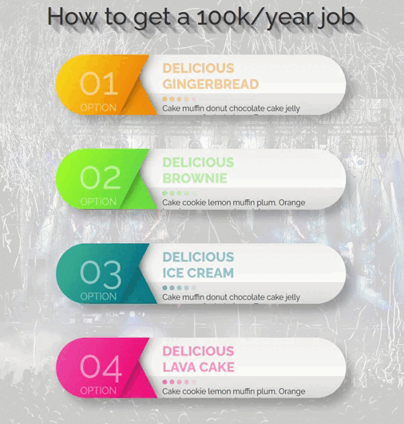

# Interactive Job Guide Cards

A modern web UI showcasing career path steps with animated cards and hover effects.
Invalid data! This is just a template for students to create from data a great visualization!

## Technologies

## Preview

Animated cards showcasing career path steps with smooth hover effects.

## Features
- Gradient-colored cards with skew animations
- Layered shadow text effects 
- Interactive hover states
- Landing page with call-to-action
- Custom background with overlay
- Smooth transitions
- Gradient numbers and icons
- Clean white panels with colored accents
- Hover animations
- Responsive design
- Shadow effects
- Custom background
